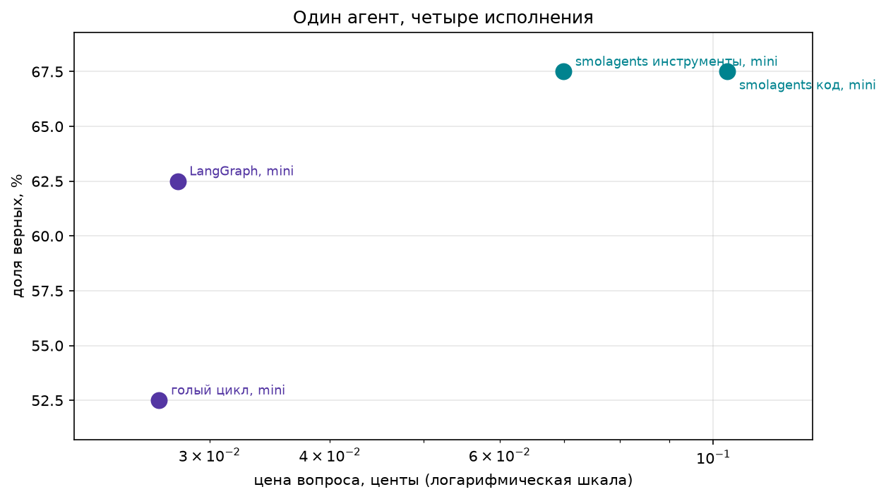
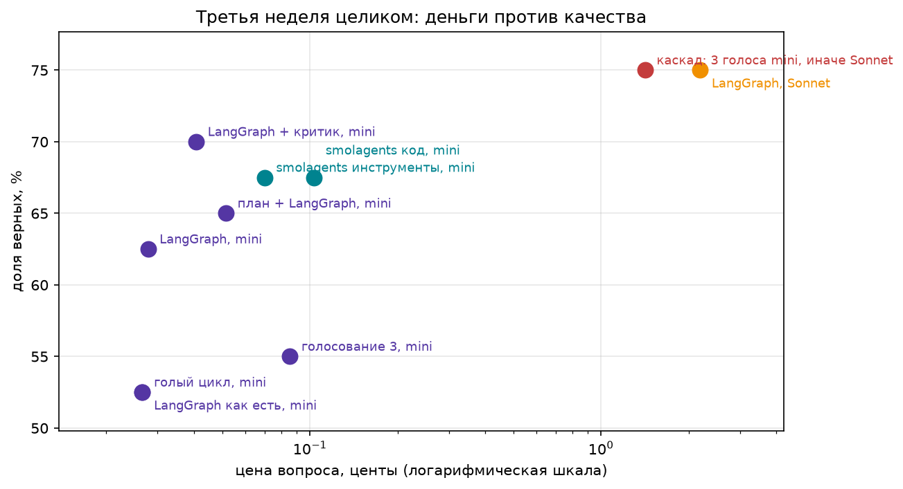

# Семинар 3. Фреймворки, критик, голосование и план: сколько стоит каждый

Один агент (вопросы о событиях 2026 года, инструменты: Википедия и DuckDuckGo), одна модель (`gpt-4o-mini`) и один счётчик денег на уровне HTTP. Мы пропускаем агента через три исполнения (голый цикл, LangGraph, smolagents), добавляем паттерны (критик, голосование с каскадом, план) и смотрим, что из этого окупается.

## Запуск

```bash
pip install -r requirements.txt
cp .env.example .env        # впишите OPENROUTER_API_KEY (и PROXY_URL, если OpenRouter недоступен напрямую)
jupyter notebook agents_frameworks.ipynb   # Restart & Run All
```

Данные лежат в `data/` (взяты 40 последних вопросов `fresh_2026.jsonl`).

## Как мерим

Все три исполнения ходят в OpenRouter через один `httpx.Client` с крючком на ответ. Каждый вызов помечается меткой конфигурации. Из ответа берутся токены на входе и выходе и цена из `usage.cost`. Верным считается ответ, в котором есть все слова эталона после нормализации (качество этой проверки разобрано ниже в разделе «Проверка проверки»).

**Про шум.** На 40 вопросах стандартная ошибка доли SE = √(p(1−p)/n), где p ∈ [0, 1] это доля верных ответов, а n = 40 число вопросов. Для p ≈ 0,5 это около ±0,08, то есть 95%-интервал примерно ±6 вопросов. Один и тот же голый цикл дал 26/40 и 21/40 в двух прогонах. Поэтому различия в 1–5 вопросов ниже считаются шумом.

## Эффект поиска

Добавление DuckDuckGo к инструментам Википедии подняло голый цикл с 16/40 до 26/40. Это самый большой прирост за весь семинар, больше любого паттерна и любого фреймворка. Повторный прогон того же цикла дал 21/40. Эффект поиска остаётся заметным даже с поправкой на шум, но точное число нестабильно: выдача DuckDuckGo меняется от запроса к запросу.

## Одно и то же четырьмя способами

| конфигурация | верно | доля | вызовов на вопрос | токенов на вопрос | центов на вопрос | центов за верный |
|---|---|---|---|---|---|---|
| голый цикл, mini | 21/40 | 0.525 | 2.9 | 1608 | 0.0266 | 0.0507 |
| LangGraph, mini | 25/40 | 0.625 | 3.0 | 1669 | 0.0278 | 0.0445 |
| smolagents инструменты, mini | 27/40 | 0.675 | 3.3 | 5981 | 0.0699 | 0.1035 |
| smolagents код, mini | 27/40 | 0.675 | 3.4 | 10019 | 0.1034 | 0.1532 |



### Стоит ли верить, что smolagents лучше всех

Скорее нет:

- **Шум.** 27/40 против 25/40 это два вопроса при погрешности около ±6. Голый цикл между прогонами прыгнул на пять вопросов, то есть сильнее.
- **Неравные условия.** У smolagents было 10 шагов вместо 6, и его инструкция содержит дополнительную подсказку про `final_answer`. Честнее было ставить ему не больше шагов, чем остальным.
- **Цена верного ответа** (главный показатель): 0,1035 цента у smolagents против 0,0445 у LangGraph, то есть в 2,3 раза дороже. Токенов на вопрос 5981 против 1669 (в 3,6 раза). У CodeAgent ещё дороже: 10019 токенов и 0,1532 цента за верный ответ.

## Налог фреймворка на пустом запросе


Один и тот же простой вопрос («What is 2 + 2? Reply with the number only.») прогнан через все четыре исполнения. Это даёт цену самого каркаса: токены уходят до того, как агент начал решать задачу.

| конфигурация | вызовов | токенов в первом запросе | всего токенов | центов | относительно цикла |
|---|---|---|---|---|---|
| голый цикл | 1 | 238 | 238 | 0.0037 | ×1 |
| LangGraph | 1 | 238 | 238 | 0.0037 | ×1 |
| smolagents, инструменты | 1 | 1269 | 1269 | 0.0199 | ×5.3 |
| smolagents, код | 1 | 2201 | 2201 | 0.0341 | ×9.2 |

**Откуда разница.** Голый цикл и LangGraph отправляют модели только наш системный промпт и схемы двух инструментов, поэтому их первый запрос совпадает до токена (238). Это измерено после починки LangGraph: в «как есть» схемы теряли описания аргументов, и запрос был бы короче, но беднее. smolagents подкладывает свой системный промпт с протоколом работы агента и описанием служебного инструмента `final_answer`: это +1031 токен на каждый вызов у `ToolCallingAgent` и +1963 у `CodeAgent`, чей промпт к тому же содержит инструкции и примеры по написанию Python-кода. Этот налог платится на каждом шаге агента, а не один раз, и копится вместе с историей.

## Итоговая таблица: все конфигурации

| конфигурация | верно | доля | вызовов на вопрос | токенов на вопрос | центов на вопрос | центов за верный |
|---|---|---|---|---|---|---|
| голый цикл, mini | 21/40 | 0.525 | 2.9 | 1608 | 0.0266 | 0.0507 |
| LangGraph как есть, mini | 21/40 | 0.525 | 3.0 | 1599 | 0.0266 | 0.0507 |
| LangGraph, mini | 25/40 | 0.625 | 3.0 | 1669 | 0.0278 | 0.0445 |
| smolagents инструменты, mini | 27/40 | 0.675 | 3.3 | 5981 | 0.0699 | 0.1035 |
| smolagents код, mini | 27/40 | 0.675 | 3.4 | 10019 | 0.1034 | 0.1532 |
| LangGraph + критик, mini | 28/40 | 0.700 | 4.5 | 2472 | 0.0407 | 0.0581 |
| голосование 3, mini | 22/40 | 0.550 | 9.1 | 5104 | 0.0854 | 0.1553 |
| каскад: 3 голоса mini, иначе Sonnet | 30/40 | 0.750 | 11.4 | 8595 | 1.4170 | 1.8893 |
| план + LangGraph, mini | 26/40 | 0.650 | 4.9 | 2965 | 0.0515 | 0.0793 |
| LangGraph, Sonnet | 30/40 | 0.750 | 4.1 | 6159 | 2.1908 | 2.9210 |

`LangGraph + критик, mini` выигрывает по цене за верный ответ и доле верных. `каскад: 3 голоса mini, иначе Sonnet` выигрывает по верным, но там где он ошибся - чаще падал с ошибка: RuntimeError.



## Паттерны

Паттерны построены на LangGraph: качество с голым циклом в пределах шума, цена верного ответа ниже (0,0445 против 0,0507), а явный граф удобен для критика.

### Критик с опорой

Критик сверяет ответ с тем, что вернули инструменты, и отдаёт вердикт по схеме Pydantic (не больше двух попыток). Результат: 28/40 против 25/40 без критика, то есть +3 вопроса за +30% к цене верного ответа (0,0581 против 0,0445).

`fixed = 3` и `broken = 0`.

### Голосование и каскад

Три независимых прогона mini при температуре 0,7. Если все совпали, берётся их ответ, иначе вопрос уходит Sonnet.

- Простое голосование **ухудшило** результат (22/40 против 25/40) и утроило цену (0,0854 против 0,0278 цента на вопрос).
- Каскад даёт те же 30/40, что Sonnet в одиночку, но дешевле: 1,8893 против 2,9210 цента за верный ответ.

Доля задач, ушедших наверх (`26` из 40). Не очень-то и экономит -_-.

### План

Отдельный вызов mini пишет короткий план, он добавляется в промпт агента. Результат 26/40 против 25/40 при цене верного 0,0793 против 0,0445: точность в пределах шума.

## Проверка проверки

Проверка ответа требует, чтобы все слова эталона нашлись в ответе. Я прочитал глазами все 12 ответов конфигурации «LangGraph + критик, mini», которые она записала в неверные:

| Категория | Вопросы | Что произошло |
|---|---|---|
| Ответил верно, проверка ошиблась | 106, 109, 144 | «People Mover» вместо «GRU Airport People Mover»; «Forty-four» вместо «44»; в 109 описана суть («arson»), но не формулировка эталона |
| Неточный ответ | 108 | назван регион, а не остров |
| Неоднозначность | 111 | «лидер партии» вместо «премьер-министр» |
| Неверный ответ | 119, 120, 133, 141 | не те города, не то название операции, не тот циклон, не тот ураган (Lowell вместо Lala) |
| Источники расходятся с эталоном | 130, 135, 138 | дата 4 вместо 3 сентября, магнитуда 6,8 (США) против 7,1 (Япония), 38,0 против 38,1 °C |

**Итог.** По чтению 3 из 12 «неверных» на самом деле верны (случай 109 пограничный: без него 2 из 12). Реальных ошибок агента 9, и в трёх из них (130, 135, 138) виноваты расходящиеся источники (ну и вероятно там просто обновили инфу), а не агент.

Причины ошибок проверки две: она не понимает числа словами (словарь `NUMBERS` покрывает только 0–12) и не знает синонимов формулировки эталона. Лечится нормализацией чисел и словарём алиасов с пересчётом всех конфигураций (`rescore`), а не подгонкой под отдельные вопросы.

## Выводы

1. **Дало прирост:** поиск в вебе (+10 вопросов у цикла) и критик с опорой на находки (28/40 за 0,058 цента за верный, в 50 раз дешевле Sonnet в одиночку при разнице в 2 вопроса). Каскад повторяет качество Sonnet (30/40) в 1,5 раза дешевле.
2. **Дорогое украшение:** smolagents (в 2,3 раза дороже за верный ответ при результате в пределах шума), простое голосование (хуже и в 3 раза дороже) и план (+78% к цене без заметного прироста).
